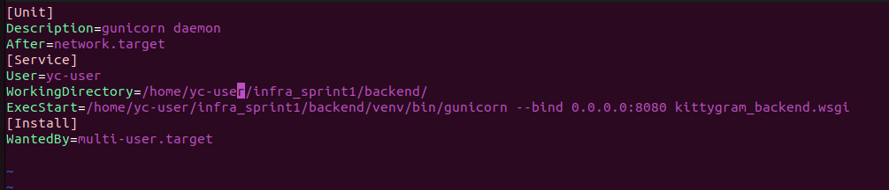
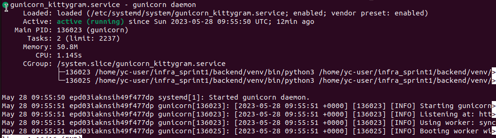
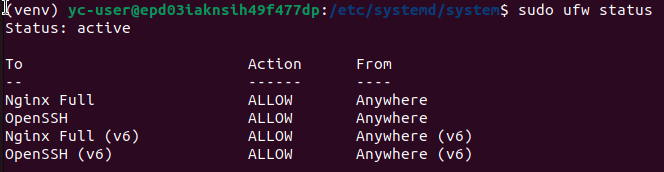
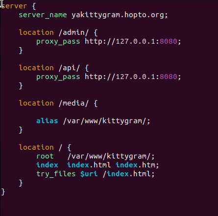
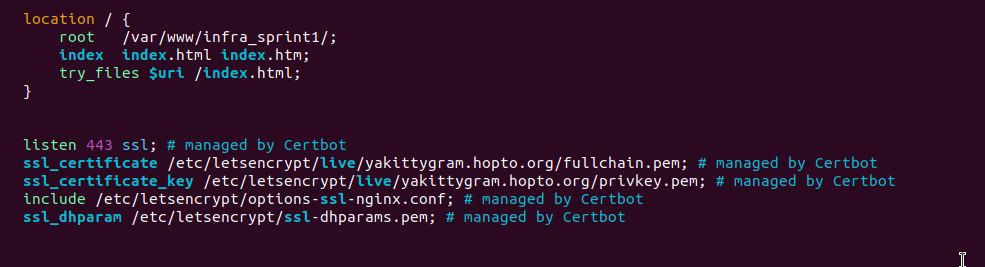
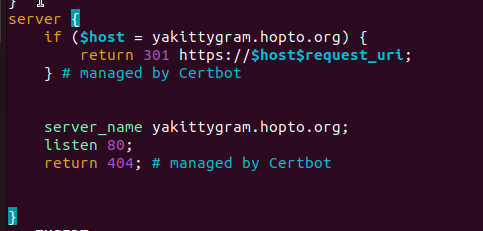

## Deploying a Web App to a Remote Server w/o Docker

### Server Gateway Interface
WSGI (англ. Web Server Gateway Interface) — стандарт взаимодействия Python-фреймворков и веб-серверов.
Gunicorn — это WSGI-сервер, созданный для использования в UNIX-системах. 
`gunicorn --bind 0.0.0.0:8000 backend.wsgi` - обращается к WSGI-серверу для того, чтобы он запустил приложение, используя файл wsgi.py, на указанном вами IP-адресе и порте.
### Утилита systemd
Systemd (от англ. system daemon — «системный демон»). Этот демон контролирует состояние запущенных процессов, в том числе и других демонов.
#### Создаём юнит для Gunicorn
Он должен:
* запускаться при старте системы;
* работать непрерывно;
* перезапускаться, если по какой-то причине отключится.
`sudo vim /etc/systemd/system/gunicorn.service`

* запуск `sudo systemctl start gunicorn_kittygram`
* проверяем работу `sudo systemctl status gunicorn`

* Добавляем процесс Gunicorn в список автозапуска операционной системы на удалённом сервере
`sudo systemctl enable gunicorn`
## Firewall ufw
Файервол - программа для ограничения доступныы портов
* оставить открытыми порты 
`sudo ufw allow 'Nginx Full'` - активирует разрешение принимать запросы на порты 80 и 443.
`sudo ufw allow OpenSSH` - ктивирует разрешение для порта 22 — это стандартный порт для соединения по SSH
* sudo ufw status 

## Собираем статику фронтенд-приложения
`npm run build` - Cборкa фронтенд-приложения, результат сохранился .../frontend/build
Чтобы Nginx раздавал статику, он должен знать, где она лежит. У веб-сервера есть системная директория, которую он использует по умолчанию для доступа к статическим файлам, — /var/www/
## Описываем настройки для работы со статикой фронтенд-приложения
* Меняем файл конфигурации веб-сервера:
`sudo vim /etc/nginx/sites-enabled/default`

* Проверка файл конфигурации на ошибки `sudo nginx -t`
* Перезапуск `sudo systemctl reload nginx`
### HTTPS
Secure Socket Layer (англ. «уровень защищённых сокетов»). Сокет — это программный интерфейс, который обеспечивает взаимодействие между процессами, работающими на одном устройстве или разных устройствах в сети.
* Получение SSL-сертификата
- установка пакета certbot
- запуск certbot и получение SSL-сертификат под веб-сервер Nginx.
`sudo certbot --nginx`
В файл /etc/nginx/sites-enabled/default добавятся новые настройки и будут прописаны пути к сертификату

